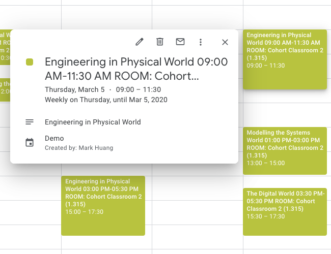

# SUTD `schedule.ics` Fixer

---

Do you know that you can import your class schedule into your Google Calendar?

You can download a `schedule.ics` file from [mymobile.sutd.edu.sg](http://mymobile.sutd.edu.sg/), but the original file is badly formatted and it won't look good on your calendar App.

This bot helps you clean up the mess in the `schedule.ics` file so that you will get a neat calendar view.

| Before | After |
| :---: | :---: |
|  |  |

## Usage

Just talk to the [**Telegram bot (SUTD_ICS)**](https://t.me/sutd_ics_bot) and follow the step-by-step instructions from there.

## Contribute / Report issues

**Pull requests, issue reporting, feature requests are very welcomed.**

- [Create a New issue](https://github.com/MarkHershey/calendar-generator/issues)

<!-- 1. Go to [mymobile.sutd.edu.sg](mymobile.sutd.edu.sg).
2. Student Log In > Schedule > Top-right option icon > Download Schedule > Select Term
3. You will get `schedule.ics` for your selected term.
4. Download this Python file [`ics_fixer2.py`](https://github.com/MarkHershey/calendar-generator/blob/master/ics_fixer2.py).
5. Open `ics_fixer2.py` using any text editor.
6. Update the value of the `path` variable at 3rd line to the path of your `schedule.ics` on your local machine.
6. Save and Run. `python3 ics_fixer2.py`
7. `new.ics` will be generated, which is the cleaned version of your schedule.
8. Import it to your google calendar now! -->
